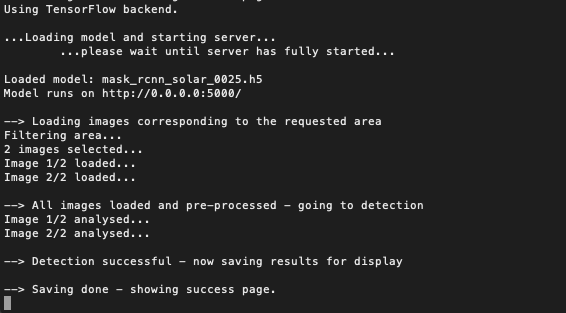
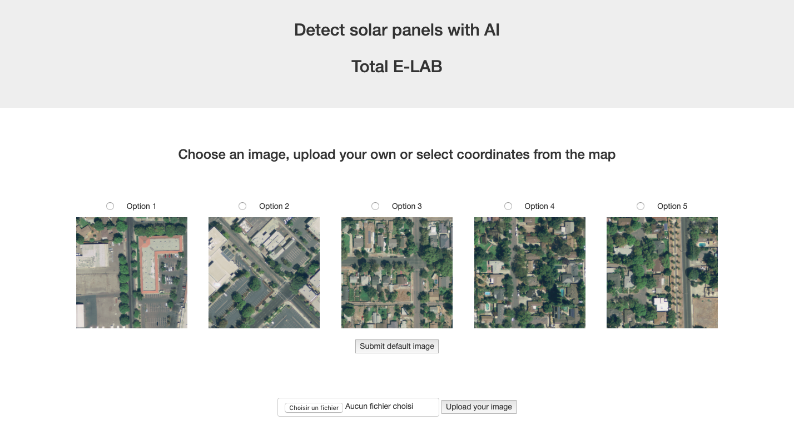
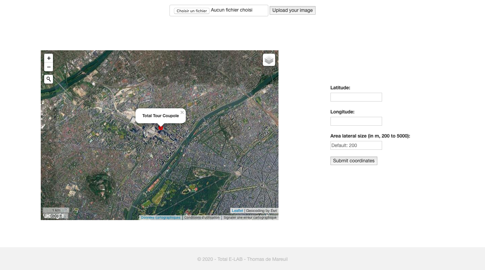

<center>
	<h1> Solar Panels detection in satellite imagery </h1>
	<p> Thomas de Mareuil - Total E-LAB - May 2020 </p>
</center>
<br>

* Repository

This repository holds the files for a satellite image analysis app able to detect solar panels from Google high-resolution overhead imagery.

The repository is organized as follows:
```bash
.
├── data
│   ├── images [2306 entries]
│   └── masks [7186 entries]
├── inference
│   └── app output folder
├── models
│   └── trained weights
├── notebooks
│   └── notebooks to build dataset + to inspect data and model
├── templates
│   └── HTML templates for the app
├── static
│   └── images and gifs served in the app
│
├── __init__.py
├── documentation.md
├── solar_app.py
└── solar.py
```
<br>

* Data

The data we used in this project primarily consists in a dataset made available by **Duke University** at this [address](https://figshare.com/collections/Full_Collection_Distributed_Solar_Photovoltaic_Array_Location_and_Extent_Data_Set_for_Remote_Sensing_Object_Identification/3255643). It includes high resolution satellite imagery (0.3m, 2016) for 4 cities in California, with polygon annotations (GeoJSON format) corresponding to solar arrays. We pre-processed the data to obtain image tiles of 500px width (1903 images) and their corresponding binary masks (5210 masks, i.e. solar array instances).

We also built a **custom dataset** with selected images of France, Belgium, Luxembourg, Switzerland, Portugal, Slovenia, Austria and Czech Republic (398 images at 0.1m resolution / 1000px width, 1978 masks), in order to complement the US dataset and increase performance on France specificities. As a basis for this dataset, we used solar panel tags and polygons from OpenStreetMap (queried through the Overpass API) and Google Static images. 

Our method to preprocess the Duke dataset and to build the custom OSM dataset are detailed in the notebooks `duke_dataset_creation.ipynb` and `osm_dataset_creation.ipynb`. You can also find extensive training data analysis and multiple visualizations in the `inspect_solar_data.ipynb` notebook.
<br>

* Model

The model we chose is **Mask R-CNN** - see original [paper](https://arxiv.org/abs/1703.06870) by FAIR, 2017, and Python [implementation](https://github.com/matterport/Mask_RCNN) by Matterport, Inc, which used as a basis for our use case. The `mrcnn` library is located in the root directory of the Demeter project, and the `solar.py` file in this folder holds all the functions specific to our solar panels segmentation task (i.e. functions overwriting `mrcnn` classes and new solar-specific utils functions). Note that there is also a `solar_4ch.py` module, with slightly different functions to support images with a 4th colour channel (relative luminance) computed on the fly during training and inference. This led to slower computation but not-so-better results so we didn't include it in the final `solar.py`, but we keep it aside for reference.

Mask R-CNN is considered as state-of-the-art (as of 2020) to perform **instance segmentation** tasks. It is based on a CNN backbone (here, ResNet101) with a Feature Pyramid Network (FPN) architecture, next to a Region Proposal Network (RPN - similar to the Faster R-CNN model), which are finally followed by customized head branches for bounding box regression and pixel-level (mask) classification. See below 2 diagrams representing the model architecture:


<center></center>
<br>

More details on Mask R-CNN can be found in this [Medium article](https://medium.com/@jonathan_hui/image-segmentation-with-mask-r-cnn-ebe6d793272) and this [presentation](https://www.slideshare.net/windmdk/mask-rcnn) by the authors of the original paper at ICCV 2017.
<br>

* Training

We started training with pre-trained COCO weights, and we trained our model in 3 successive steps. In the first step, we trained only the head layers (i.e. freezing the ResNet101 feature pyramid backbone) for 20 epochs. Then in the 2nd step we fine-tuned the layers from ResNet stage 3 and up, for another 20 epochs. Finally, we fine-tuned the whole model 20 last epochs. We decreased learning rate at each step, starting at 0.01, then dividing by 5, and finally by another factor of 5 (i.e. final learning rate at 0.0004).

The loss function we try to minimize is a composite function made up of several losses corresponding to each branch of the model (RPN classification loss, RBN bbox regression loss, head classification, head bbox regression loss, head mask loss), equally weighted in the total loss. To avoid overfitting, at each step we set early stopping at 5 epochs without validation loss improvement. 

We used a single GPU with 16Gb RAM, and at each step we kept aside 8% of the data (185 images) for validation. We also kept aside another 8% that the model never sees, for testing purposes. As part of training, we perform image augmentation (using `imgaug`) at each step and add a 4th channel to each input image, corresponding to Relative Luminance (formula: $Y=0.2126R+0.7152G+0.0722B$). Note that using this 4th channel significantly complicates the model for minor gains, so we did not keep it in the final version. The training routine is detailed in the `train_solar_colab.ipynb` notebook.
<br>

* Testing

After training, our model reaches a **Mean Average Precision score** (mAP) at IoU=0.5 of **≈0.6 on the test set** (10% of images). This is quite a good score (roughly corresponding to state-of-the-art scores on the reference COCO dataset as of 2020, see this [link](https://paperswithcode.com/sota/instance-segmentation-on-coco)), especially for our use case! To increase performance we could have performed K-fold cross-validation by training the model 10 times with a different 10% of the data as validation set, but this would have taken a lot of time for improvements that are irrelevant to our project.

In a few words, mean average precision is a commonly used metric for instance segmentation tasks. It is based on the area under the Precision-Recall curve. For he precision and recall computations, True Positives correspond to predicted masks whose IoU score (Intersection over Union, compared to the ground truth mask) stands above a certain threshold (here, 0.5). We go through detailed model testing steps in the `inspect_solar_model.ipynb` notebook. See below some detection examples:

<center></center>
<br>
<center></center>
<br>
<center></center>
<br>

You can also find more details on the mAP metric in these 2 blog posts: [link](https://www.jeremyjordan.me/evaluating-image-segmentation-models/) and [link](https://towardsdatascience.com/breaking-down-mean-average-precision-map-ae462f623a52).
<br>

* Web application

We built an application with `flask` to serve the model with a user-friendly interface. To get the correct installation and run the app locally, please run the following commands in your terminal:
```bash
cd emp-demeter/demeter/pvpanels/
conda env create -f environment.yml -n solarenv
conda activate solarenv
python solar_app.py
```

When using the app, all the satellite images downloaded through the interface and all the detection results from the model will end up in the `inference` folder. You can also see and modify the static files necessary to style the app in the `static` folder. The HTML templates for the home and success pages are in the `templates` folder. The app uses AJAX, JQuery and Jinja2 frameworks. It runs best on Google Chrome, but will work with any browser.

While running, the app displays status information at each step in the terminal. In the web interface, the user can select coordinates (latitude/longitude) and area size from an embedded javascript `Leaflet` map. The app then checks if there are buildings (and therefore, potentially solar panels) in the area through OpenStreetMap's `Overpass` API, and downloads high-resolution satellite images from Google Static API (0.1m resolution, 200m width image tiles).

<center></center>
<br>

Finally, the app performs solar panels instance segementation using our trained Mask R-CNN model and redirects to the `\success` (or `\success\batch`) page, where the user can visualize results overlayed on a Leaflet map. They can also download a detection summary (Excel format) and a GeoJSON file holding coordinates for all the polygons corresponding to the detected solar arrays.

<center></center>
<br>
<center></center>
<br>

* Next steps

This app is to be used by Total E-LAB's data scientist for model testing purposes and to present model results to clients as part of quick demos. It is then to be improved and integrated in Total's Azure ecosystem by the E-LAB back-end developers team, so that several Group subsidiaries (Quadran, Direct Energie, Total Energy Trading) can use it in production.

The model, notebooks and application are to be used as a template and adapted by Total E-LAB to other satellite image analysis use cases, such as parking detection, lake detection, etc. We could especially imagine a single app based on this first project, serving several object detection models from a single interface. 

Finally, for future projects we could potentially move on to Facebook's ["Detectron 2"](https://github.com/facebookresearch/detectron2) framework, which is their brand new computer vision framework (still in development), including a new (faster) implementation of Mask R-CNN and other innovative models using PyTorch instead of TensorFlow.
